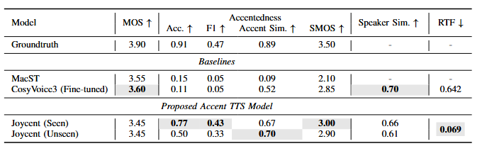

# Joycent

Official implementation of **Joycent**, a Mandarin accent text-to-speech (TTS)
framework, together with the pretrained accent identification model
**WhisAID** and a **ParallelWaveGAN** vocoder.

Project demo page: [anonymous-accent-tts.github.io/Joycent-demo](https://anonymous-accent-tts.github.io/Joycent-demo/)

## Results And Demos

<table>
  <tr>
    <td width="50%" valign="top">
      <h3>WhisAID Results</h3>
      <p>Results cover seen speakers, unseen speakers, the generalization gap, and SCSC. Higher is better except for <strong>Gap↓</strong> and <strong>SCSC↓</strong>.</p>
      
    </td>
    <td width="50%" valign="top">
      <h3>WhisAID Demo</h3>
      <p>
        <a href="https://huggingface.co/spaces/walston/whisaid-demo"></a>
        <a href="https://huggingface.co/walston/whisaid-zh-grl"></a>
      </p>
      <p>Upload or record speech to predict its accent and inspect the full class distribution.</p>
      <a href="https://huggingface.co/spaces/walston/whisaid-demo">
        
      </a>
    </td>
  </tr>
  <tr>
    <td width="50%" valign="top">
      <h3>Joycent Results</h3>
      <p>Results cover speech quality, accentedness, accent similarity, speaker similarity, and real-time factor. Higher is better except for <strong>RTF↓</strong>.</p>
      
    </td>
    <td width="50%" valign="top">
      <h3>Joycent Demo</h3>
      <p>
        <a href="https://huggingface.co/spaces/walston/joycent-demo"></a>
        <a href="https://huggingface.co/walston/joycent"></a>
      </p>
      <p>Joycent and the Singaporean-accented Mandarin speech data fine-tuned CosyVoice3 model.</p>
      <a href="https://huggingface.co/spaces/walston/joycent-demo">
        
      </a>
    </td>
  </tr>
</table>

## Installation

The project is tested with Python 3.10 and CUDA-enabled PyTorch.

```bash
conda create -n joycent python=3.10 -y
conda activate joycent
pip install -r requirements.txt
pip install pytorch-lightning==2.4.0 --no-deps
```

Initialize the third-party submodules:

```bash
git submodule update --init --recursive
```

Build the monotonic alignment extension:

```bash
cd joycent/model/monotonic_align
python setup.py build_ext --inplace
cd ../../..
```

## Pretrained Models

| Component | Repository | Description |
| --- | --- | --- |
| WhisAID | [walston/whisaid-zh-grl](https://huggingface.co/walston/whisaid-zh-grl) | Mandarin accent classifier and accent encoder |
| Joycent | [walston/joycent](https://huggingface.co/walston/joycent) | Joycent acoustic checkpoint |
| Joycent vocoder | [walston/joycent-vocoder](https://huggingface.co/walston/joycent-vocoder) | ParallelWaveGAN checkpoint and configuration |
| CosyVoice3 SG | [walston/cosyvoice3-sg](https://huggingface.co/walston/cosyvoice3-sg) | SG-only fine-tuned `llm.pt` |
| CosyVoice3 base | [FunAudioLLM/Fun-CosyVoice3-0.5B-2512](https://huggingface.co/FunAudioLLM/Fun-CosyVoice3-0.5B-2512) | Official tokenizer, Flow, HiFT, and auxiliary files |

## WhisAID

WhisAID identifies Mandarin accents and extracts accent embeddings. The
released Chinese checkpoint supports **12 accent labels**.

### Data

WhisAID filelists live in `resources/whisAID/zh_all`. Each row contains:

```text
relative_wav_path|speaker_id|accent_id
```

The wav path is resolved against `--data-root`, keeping the CSV files
machine-independent:

```text
--data-root /path/to/data
/path/to/data/
  aishell3/
  magichub_multiaccent/
    magichub_singapore/
    ...
```

### Fine-Tuning

Set `DATA_ROOT` and the training options at the top of `run_whisAID.sh`, then
run:

```bash
bash run_whisAID.sh
```

### Evaluation

Set `DATA_ROOT` and `TARGET_REFERENCE_AUDIO` at the top of
`infer_whisAID.sh`, then run:

```bash
bash infer_whisAID.sh
```

The script reports classification metrics and the accent similarity between
each test utterance and the target reference audio.

### Accent Embeddings

```python
import torch
from transformers import AutoModel
from whisper import load_audio, log_mel_spectrogram, pad_or_trim
from whisAID import WhisAIDConfig

model = AutoModel.from_config(
    WhisAIDConfig(checkpoint_repo_id="walston/whisaid-zh-grl")
).cuda().eval()

audio = torch.from_numpy(load_audio("/path/to/audio.wav"))
mel = log_mel_spectrogram(
    pad_or_trim(audio),
    n_mels=model.config.n_mels,
).unsqueeze(0).cuda()

with torch.no_grad():
    output = model(input_ids=mel)

accent_embedding = output.features[0].cpu().numpy()
accent_id = output.logits.argmax(dim=-1).item()
```

## Joycent

### Data And Features

Joycent filelists contain four fields:

```text
relative_wav_path|phoneme_sequence|speaker_id|accent_id
```

The wav path is resolved against `--data-root`. Before training, extract the
FACodec speaker embeddings and WhisAID accent embeddings:

```bash
bash feature_extraction/extract_feature.sh
```

Configure `DATA_ROOT`, `FILELIST`, GPU settings, and `STAGE` at the top of the
script. Use `STAGE=spk` or `STAGE=acc` to extract only one feature type.

Speaker embeddings are stored under `facodec_spk`, while accent embeddings are
stored under `feat_acc_grl_030326`.

### Training

Configure the paths and hyperparameters at the top of `run_joycent.sh`, then
run:

```bash
bash run_joycent.sh
```

### Inference

Set `MODEL=joycent` or `MODEL=cosyvoice` at the top of `infer_joycent.sh`:

```bash
bash infer_joycent.sh
```

For Joycent, select local or Hugging Face acoustic and vocoder checkpoints with
`MODEL_SOURCE` and `VOCODER_SOURCE`. The released checkpoints are stored in
`walston/joycent` and `walston/joycent-vocoder`.

For CosyVoice3, the script loads the official
`FunAudioLLM/Fun-CosyVoice3-0.5B-2512` base model and replaces its `llm.pt`
with the SG-only checkpoint from `walston/cosyvoice3-sg`.

## Acknowledgements

Parts of this repository are adapted from the following open-source projects:

- [Whisper](https://github.com/openai/whisper)
- [Grad-TTS](https://github.com/huawei-noah/Speech-Backbones/tree/main/Grad-TTS)
  from [Speech-Backbones](https://github.com/huawei-noah/Speech-Backbones)
