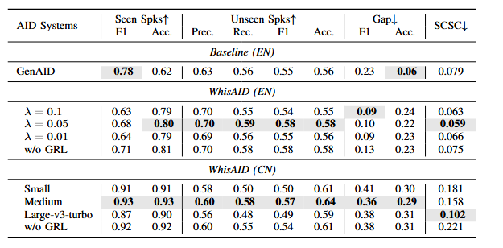
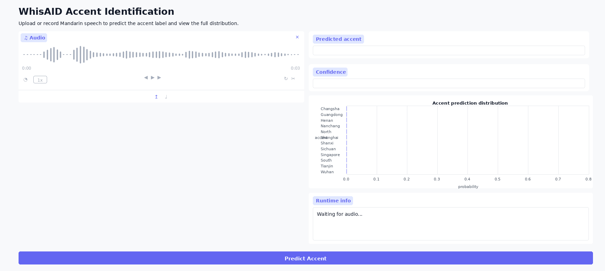

# Joycent Code

Official implementation of **Joycent**, an accent text-to-speech (TTS) framework for Mandarin, together with the pre-trained accent identification model **WhisAID** and the **ParallelWaveGAN** vocoder.

## Results and Demo

<table>
  <tr>
    <td width="50%" valign="top">
      <h3>WhisAID Results</h3>
      <p>Metrics are reported on seen speakers, unseen speakers, generalization gap, and SCSC. Higher is better except for <strong>SCSC↓</strong>.</p>
      
    </td>
    <td width="50%" valign="top">
      <h3>WhisAID Demo</h3>
      <p>
        <a href="https://huggingface.co/spaces/walston/whisaid-demo"></a>
        <a href="https://huggingface.co/walston/whisaid-zh-grl"></a>
      </p>
      <p>The demo accepts uploaded audio or microphone recording, predicts the accent name, and shows the full prediction distribution.</p>
      <a href="https://huggingface.co/spaces/walston/whisaid-demo">
        
      </a>
    </td>
  </tr>
</table>

## Environment

Tested with Python 3.10 and CUDA-enabled PyTorch.

```bash
conda create -n joycent python=3.10 -y
conda activate joycent
pip install -r requirements.txt
pip install pytorch-lightning==2.4.0 --no-deps
```

Build the monotonic alignment extension:

```bash
cd model/monotonic_align
mkdir -p model/monotonic_align
python setup.py build_ext --inplace
cd ../..
```

Initialize third-party submodules:

```bash
git submodule update --init --recursive
```

## Pretrained Models

| Model | Link | Notes |
| --- | --- | --- |
| WhisAID Chinese accent classifier | https://huggingface.co/walston/whisaid-zh-grl | Used by `whisAID_inference.py` with `--checkpoint-repo-id walston/whisaid-zh-grl`. |

## WhisAID

WhisAID is a Mandarin accent identification model. The released Chinese checkpoint supports **12 accent labels** and can be used for both classification and accent embedding extraction.

### Data

Filelists live in `resources/whisAID/zh_all` and use relative wav paths:

```text
relative_wav_path|speaker_id|accent_id
```

Pass the audio root at runtime with `--data-root`.

### Fine-Tuning

```bash
./run_whisAID.sh
```

### Evaluation

```bash
./infer_whisAID.sh
```

For F1, classification report, and reference-speech accent similarity:

```bash
PYTHONPATH=. python whisAID_eval.py \
  --checkpoint-repo-id walston/whisaid-zh-grl \
  --test-path resources/whisAID/zh_all/test_unseen.csv \
  --data-root /path/to/data_root \
  --target-reference-audio /path/to/reference_speech.wav
```

### Accent Embedding

```python
import torch
from transformers import AutoModel
from whisper import load_audio, log_mel_spectrogram, pad_or_trim
from whisAID import WhisAIDConfig

model = AutoModel.from_config(
    WhisAIDConfig(checkpoint_repo_id="walston/whisaid-zh-grl")
).cuda().eval()

audio = torch.from_numpy(load_audio("/path/to/audio.wav"))
mel = log_mel_spectrogram(pad_or_trim(audio), n_mels=model.config.n_mels).unsqueeze(0).cuda()

with torch.no_grad():
    out = model(input_ids=mel)

accent_embedding = out.features[0].cpu().numpy()
accent_id = out.logits.argmax(dim=-1).item()
```

## Joycent

### Feature Preparation

Before Joycent fine-tuning, dump the speaker and accent embeddings used by the training dataset. Both scripts read the same filelist format as training:

```text
wav|text|spk|acc
```

The wav path is relative to `--data-root`. Speaker embeddings are written next to the wav tree under `facodec_spk`, and accent embeddings are written under `feat_acc_grl_030326`.

Recommended batched extraction:

```bash
DATA_ROOT=/path/to/data_root \
FILELIST=resources/filelists/zh_all/train.txt \
GPUS=0,1 \
NUM_WORKERS=2 \
ACC_BATCH_SIZE=16 \
bash extract_feature.sh
```

Use `STAGE=spk` or `STAGE=acc` to run only one embedding type.

```bash
PYTHONPATH=. CUDA_VISIBLE_DEVICES=0 python dump_spk_embeddings.py \
  --data-root /path/to/data_root \
  --filelist-path resources/filelists/zh_all/train.txt
```

```bash
PYTHONPATH=. CUDA_VISIBLE_DEVICES=0 python dump_acc_embeddings.py \
  --data-root /path/to/data_root \
  --filelist-path resources/filelists/zh_all/train.txt \
  --checkpoint-repo-id walston/whisaid-zh-grl
```

Repeat the same commands with `--filelist-path resources/filelists/zh_all/valid.txt` if the validation wavs are not already covered by the training filelist.

The old entry points `facodec.py` and `dump_acc_features.py` are kept as compatibility wrappers, but new runs should use `dump_spk_embeddings.py` and `dump_acc_embeddings.py`.

### Training

TTS filelists use the same relative-path convention as WhisAID. Each row keeps four fields:

```text
wav|text|spk|acc
```

The wav field is resolved against `--data-root`, so the repository filelists do not need machine-specific absolute paths. Run from the repository root:

`lengths.json` follows the same convention: keys are relative wav paths that match the filelists, and the training dataset resolves them with `--data-root` when audio needs to be loaded.

```bash
PYTHONPATH=. CUDA_VISIBLE_DEVICES=0 python train_joycent.py \
  --data-root /path/to/data_root \
  --train-filelist-path resources/filelists/zh_all/train.txt \
  --valid-filelist-path resources/filelists/zh_all/valid.txt \
  --log-dir logs/joycent \
  --pretrained-model /path/to/acoustic_checkpoint.pt
```

Omit `--pretrained-model` to start from scratch. Other commonly changed options are `--batch-size`, `--learning-rate`, `--n-epochs`, and `--master-port`.

### Inference

Edit paths in `inference_joycent.py`:

- acoustic checkpoint path
- vocoder checkpoint path
- mel output directory
- prompt speaker/audio paths

Then run:

```bash
PYTHONPATH=. CUDA_VISIBLE_DEVICES=0 python inference_joycent.py
```

Generated wav files are written under the configured output directory.

## Logs

TensorBoard:

```bash
tensorboard --logdir logs
```

Common output locations:

```text
logs/
exp/
outputs/
```

## Repository Rules

This repo excludes:

- files larger than 100 MB
- soft links
- checkpoints and model weights
- raw datasets
- generated wav/audio samples
- Python caches and build artifacts

Before pushing:

```bash
find . -type l -ls
find . -type f -size +100M -print
git status
```

Both `find` commands should return nothing.
